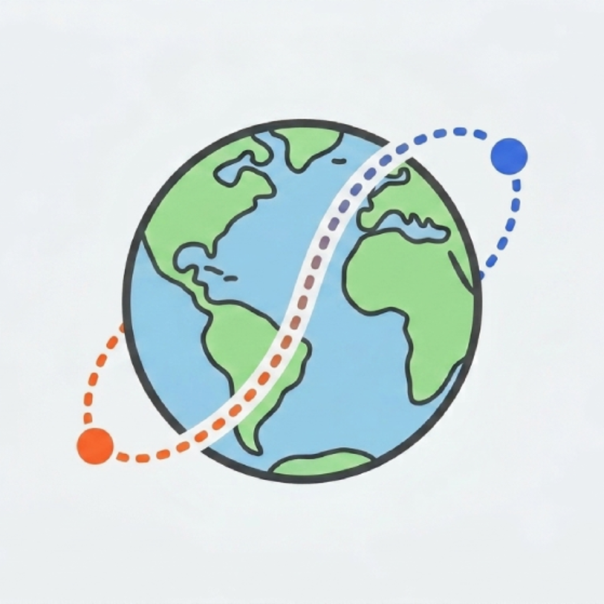

# Travel Route Animation



This web app helps travelers, creators, and video editors create animated travel route videos on a 3D globe. Add your stops, choose the transport mode for each route segment, customize the visual style, and export the result as an MP4 video ready to use in your projects.

## Features

*   **Interactive 3D Globe**: Preview your travel route directly on a globe.
*   **Route Builder**: Search and add cities/stops, then reorder or remove them as needed.
*   **Transport Modes**: Choose the vehicle for each route segment, including plane, ship, train, bus, camper, car, motorbike, bike, and scooter.
*   **Customizable Style**: Edit route colors, globe colors, line style, distance display, and visual scale.
*   **Multiple Export Formats**: Export videos in landscape, portrait, or square format as an MP4 file.
*   **Multi-language Interface**: Switch between Italian and English.

## How to Use

The web app is free to use at this link: [Travel Route Animation](https://travelrouteanimation.vercel.app/)
1.  **Add Your Stops**: Use the search field to add the cities or places you want to include in your route.
2.  **Arrange the Route**: Reorder stops or remove the ones you no longer need.
3.  **Choose Transport Modes**: Select the transport type for each route segment.
4.  **Customize the Style**: Open the route settings to adjust colors, line style, distance options, and element scale.
5.  **Preview the Animation**: Use the play controls to preview the trip animation on the globe.
6.  **Export the Video**: Choose format, resolution, and FPS, then download the MP4 video.

## Setup and Installation

If you want to run this web app locally, follow these steps:

### Prerequisites

Make sure you have **Node.js 20.9.0 or newer** and npm installed.

### 1. Clone the Repository

```bash
git clone https://github.com/MaskenNetwork/Travel_Route_Animation.git
cd Travel_Route_Animation
```

### 2. Install Dependencies

```bash
npm install
```

### 3. Run the Development Server

```bash
npm run dev
```

Open [http://localhost:3000](http://localhost:3000) in your browser.

## Credits

Transport icons are based on the **Vehicles and Transport Glyphs** collection from SVG Repo:

*   Collection: [Vehicles and Transport Glyphs](https://www.svgrepo.com/collection/vehicles-and-transport-glyphs/)
*   Author: [wishforge.games](https://www.svgrepo.com/author/wishforge.games/)

World map data is loaded from `public/data/world-110m.json`.

## Contributing

Contributions are welcome! Please feel free to submit a Pull Request or open an Issue.

## Support the Project

If you find this app useful and would like to support me, consider making a donation.

<p>
  <a href="https://paypal.me/maskennetwork" target="_blank">
    
  </a>
</p>

## License

This project is released under the [MIT License](LICENSE).
